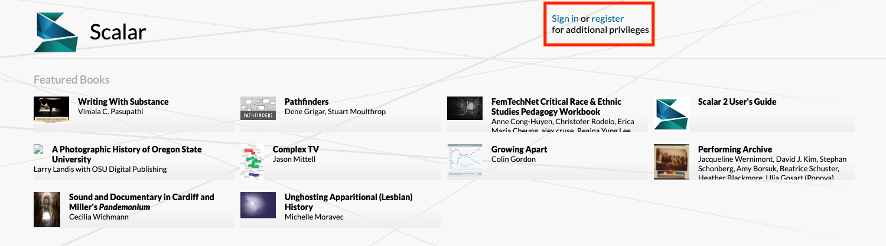
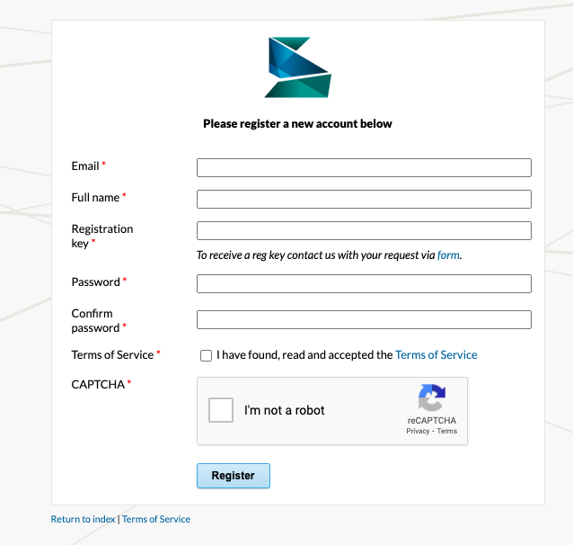
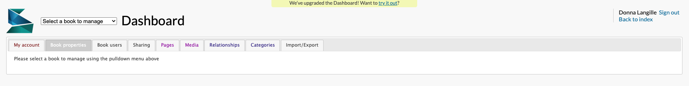

# How to set up a Scalar account 

Go to [Scalar](https://scalar.usc.edu/works/) and register for an account. 

If you did not receive a registration key from your workshop facilitator, you will need to request a registration key by filling out the form. 
{: .note}

After you have created your Scalar account, select **Dashboard** and you will be taken to the **Dashboard** where you can edit your Scalar project.

## Getting started 

To begin working with Scalar, you will first need to create a book where you can add all your content including pages, media, and relationships. 

Under **My Books**, add the title of your new book and select **Create New Book**, enter the title for your new book and select the **Create* button**. Your new book will appear under my Books.

Select the book you would like to edit from your drop-down menu. 

**Book Properties** contains various settings for the book. In Basics, add a Subtitle and Description for the project. The URI segment of the project’s web address can be edited. Table of Contents can be created once pages have been added to the book. In **Style**, ensure that the latest version, (Scalar 2) is selected. The rest of the Style settings can be revisited later on.

Custom CSS or Javascript enable customization of global style aspects of a project, and page level aspects of a project can be modified.

## Book Users

You can add users to your book project so you can collaborate. Collaborators need to have their own Scalar account. Once they are registered, add them by selecting selecting **Add User**. Search for their name.

There are four different types of users: author, commentator, reviewer and reader. 

* Author: Full editing privileges.
* Commentator: Can edit existing pages, and create pages which will be flagged as commentaries to end users; no other editing privileges.
* Reviewer: Can edit existing pages; no other editing privileges.
* Reader: Can add signed comments to public pages; no other special privileges.

