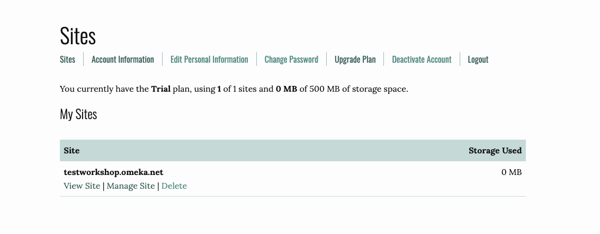

# How to set up a Scalar account 

Go to https://scalar.usc.edu/works/ and register for an account. 
If you did not receive a registration key from your workshop facilitator, you will need to request a registration key by filling out the form. 
{: .note}

After you have created your Scalar account, select **Dashboard** and you will be taken to the **Dashboard** where you can edit your Scalar project.

## Getting started 

Under **My Books**, add the title of your new book and select **Create New Book**. Your new book will appear under my Books.

Select the book you would like to edit from your drop-down menu. 

Under Book Properties, you can change **Basic** information (e.g. title and author), **Style** and **Publisher** information. 

## Book Users

You can add users to your book project so you can collaborate. Collaborators need to have their own Scalar account. Once they are registered, add them by selecting selecting **Add user**. Search for their name.

There are four different types of users: author, commentator, reviewer and reader. 

Author: Full editing privileges.
Commentator: Can edit existing pages, and create pages which will be flagged as commentaries to end users; no other editing privileges.
Reviewer: Can edit existing pages; no other editing privileges.
Reader: Can add signed comments to public pages; no other special privileges.

