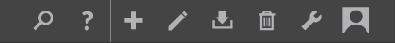
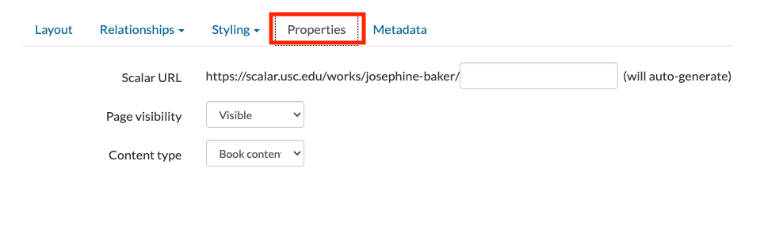
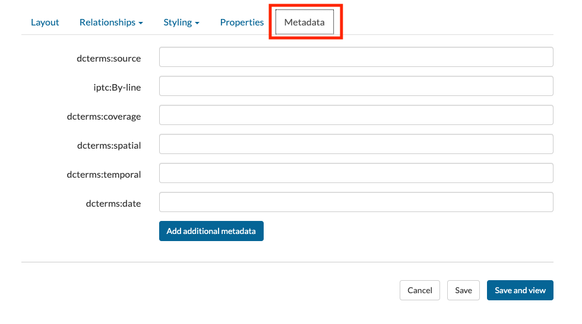
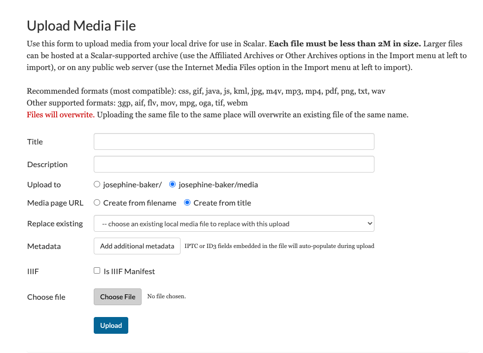
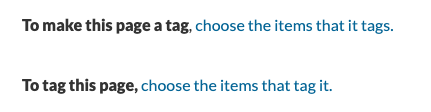
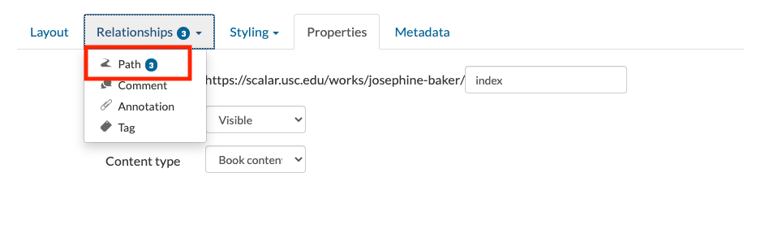

# Building Digital Projects with Scalar 

To start building your digital project, click on Back to Book in the right hand corner of the Dashboard. 

This will take you to another interface where you can edit your project. All of the tools that you will need are on the righthand side of the screen.

## Add Pages

To add a page, click on the **plus** icon. You will be asked to provide a title and a description. You can add content to your page, including text or multimedia. 

You may also select a **Layout**. 

Under **Properties**, you can create a URL for your page as well as select whether you want the page to be visible or hidden. You may want to hide the page until you are finished editing. 

Under **Metadata**, you can add metadata for your page which will ensure that your project is easier to find by people on the Internet. 

You can edit any existing pages by selecting the **pencil** icon. 

## Add Media 

Scalar can host a variety of media types, including images (JPG, DZI, GIF, etc.) video (MP4, FLV), and audio (MP3, WAV). There are a number of ways to organize media on a page. Different media objects, including images, video, and audio files, can be referenced by links within text, located next to text, or inline with text. Every piece of media that you use in your project is treated as its own page. To add media, select the **downward facing arrow** icon. There are multiple ways to add media in your Scalar project. 

# Upload media 

You can upload media files from your own computer; however, each file size must be less than than 2M in size. If your file is bigger than 2M than you will have to upload it to your own server first or link to it. 

You can provide a title and description for each piece of media, as well as metadata. To provide a citation for your piece of media, select **add additional metadata**, and then **bibliographicCitation** and select **Add Field**. Here you can provide a citation for your piece of media. 

# Link to media 

You can also link to media that exists on other websites such as Wikimedia by providing the url. 

## Link to a Scalar-affiliated media archive or web service

Scalar works with various media archives and web service that make it easy to share content from these sites. You can select media directly from Critical Commons, YouTube, Internet Archive, Soundcloud, Vimeo, and Omeka sites. 

# Relationships

## Add tags 

Tags are non-linear groupings of content. They can be used to create connections between items, but are also their own piece of content. You can group pages by using tags. To add a tag to your page, select the pencil icon to edit the page, and select **Relationships**. From this list, select **Tag**. Next to the text "To make this page a tag," click "specify the items that it tags." Select the content you want to tag and click "Add selected."

## Add Annotations

Annotations can be used to highlight certain aspects of a media object. You can add annotations to both videos and images.

To add an annotation to an image, select an image from the Media gallery via the Dashboard. When you have found the media object you would like to annotate, click the **Paperclip icon**. Click and drag the cursor over the area of the image to be annotated. Add an annotation. Below the image, a box displays the annotation in the Title field. Add full content of the annotation in the Content field, and an optional description of the annotation in the Description field.

Too add an annotation to a video, select a video from the Media gallery. Click the Annotate (paper clip) button.
Create an annotation by clicking on the plus button, located in the box below the video display.  Drag the play head to the desired start location, then select the green Start Set button. Drag the play head to the desired end location, then select the green green End Set button. Add content, description, and tags. Add additional annotations to the same video by selecting the plus button, located in the box below the video display.

## Create Paths 

“A path is a linear sequence of content. You can turn any page or media file into a path simply by specifying the pieces of content it contains and their order. Any time you want your reader to experience content in a specific order, use a path” (Scalar). 

Create a path from the Home page to an Introduction page by selecting the Edit button on the Home page. Scroll down to the Relationships tab, select Path from the drop down, and click choose the items that it contains. Select the link from the pages that are listed. Immediately create an Introduction page by selecting Create-on-the-fly button, lower left. In the title field, type ‘Introduction’, then select Save and link. The Home page now includes a “Begin with ‘Introduction'” button to prompt readers.

Repeat the above steps (with the exception of using the  Create-on-the-fly button) to create a path from the Introduction page to the next page of the project. Paths can be created for each page to direct viewers to other pages (and other content). The sequence does not need to a linear sequence. This is a way to promote non-linear narrative structures.

## Add a Table of Contents

Once you are comfortable creating and editing pages, you can organize your pages by adding a table of contents via the Dashboard. To manage your TOC, select the Book Properties tab, next to Table of contents select Add table of contents item.

Once you select Add table of contents item, a pop-up window allows you to select which items to include in the table of contents. Any one of the content types discussed earlier (pages, media, tags, etc.) can be added to the TOC.

To re-order the table of contents, simply drag-and-drop to the required position.

## Sharing your project 

The **Sharing** tab in the Dashboard allows you to choose whether or not you want to make your Scalar project URL public or private and whether or not you want to make it appear in the Scalar index. 

## Privacy

Please note that Scalar stores its [data](https://info.omeka.net/signup/privacy-policy/) in the United States. If you are asking students to create projects using Scalar, students should be made aware of this and given the option to make their work anonymous or to sign up without using personally identifying information. For more information on UBC privacy facts, read the [Privacy Fact Sheet on Collecting Personal Information](https://universitycounsel.ubc.ca/files/2020/01/Fact-Sheet-Collecting-Personal-Information.pdf).

Remember, students at UBC own their intellectual property so they have the right to refuse openly licensing their work. It’s necessary to communicate the risks and value of working in the open and/or public with your students. Librarians can help you with that!

## Accessibility

Accessibility is important. There are steps you can take to make sure you are making your project as accessible as possible. For example, if you are uploading multimedia content such as videos or sound clips, make sure you have included a transcription or provided a description. When uploading images to websites, you should include alt-text or captions. [Alt-text](https://moz.com/learn/seo/alt-text) provides a description of an image that can be read by a screen reader. 
